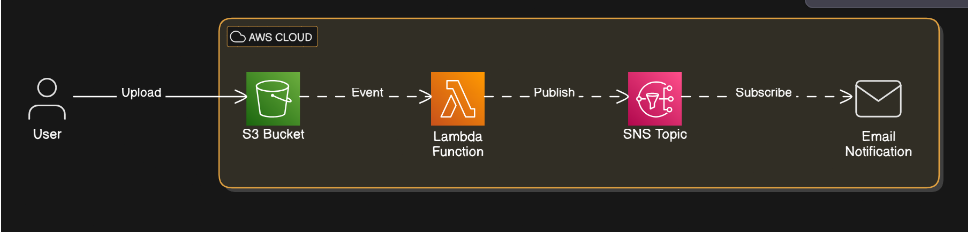

# S3 Notification System

This project implements an event-driven architecture using AWS serverless services. It sends email notifications via Amazon SNS when a file is uploaded to an Amazon S3 bucket.

## Architecture

![Architecture Diagram]

The architecture consists of the following components:

1. **S3 Bucket** - Receives file uploads which trigger Lambda notifications
2. **Lambda Function** - Processes S3 events and sends notification messages to SNS
3. **SNS Topic** - Receives messages from Lambda and distributes to subscribers
4. **Email Subscription** - Email addresses receive notifications from SNS

## Project Structure

```
.
├── .github/workflows/         # GitHub Actions workflows
│   └── deploy.yml             # CI/CD pipeline configuration
├── s3-notification-function/  # Lambda function code
│   ├── src/                   # Java source code
│   └── pom.xml                # Maven Build configuration
├── template.yaml              # AWS SAM template
├── samconfig.toml             # SAM CLI configuration
└── README.md                  # Project documentation
```

## Prerequisites

- AWS Account
- AWS CLI configured locally
- GitHub repository
- GitHub Secrets configured with AWS credentials:
    - `AWS_ACCESS_KEY_ID`
    - `AWS_SECRET_ACCESS_KEY`

## Deployment

The project supports two environments:
- **Dev** - For development and testing
- **Prod** - For production use

### Manual Deployment

1. Install dependencies:
   ```
   cd s3-notification-function
   mvn build
   ```

2. Build the SAM application:
   ```
   sam build
   ```

3. Deploy to dev environment:
   ```
   sam deploy --config-env dev --no-fail-on-empty-changeset --no-confirm-changeset 
   ```

4. Deploy to prod environment:
   ```
   sam deploy --config-env prod --no-fail-on-empty-changeset --no-confirm-changeset 
   ```

### Automated Deployment with GitHub Actions

The CI/CD pipeline is automatically triggered when:
- Changes are pushed to the `main` branch (deploys to prod)
- Changes are pushed to the `dev` branch (deploys to dev)

## Testing

1. Navigate to the S3 console
2. Upload a file to the created S3 bucket
3. Check your email for the notification

## Customization

To add more email subscribers, modify the SAM template to include additional `AWS::SNS::Subscription` resources or update the existing subscription.

## Resources

- [AWS SAM Documentation](https://docs.aws.amazon.com/serverless-application-model/latest/developerguide/what-is-sam.html)
- [AWS Lambda Documentation](https://docs.aws.amazon.com/lambda/latest/dg/welcome.html)
- [Amazon S3 Documentation](https://docs.aws.amazon.com/s3/index.html)
- [Amazon SNS Documentation](https://docs.aws.amazon.com/sns/latest/dg/welcome.html)